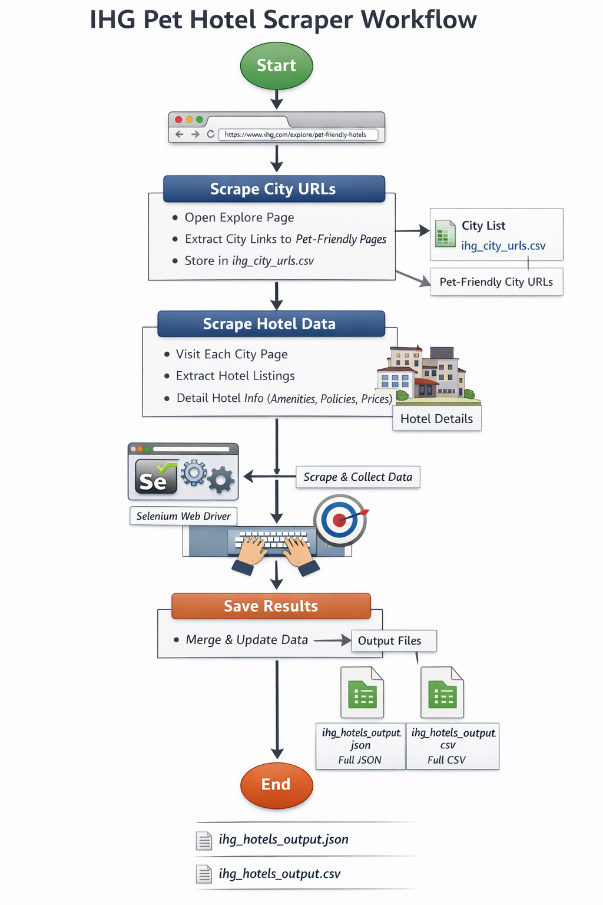

# IHG Pet-Friendly Hotels Scraper 🐾🏨

A robust, crash-resilient Selenium scraper that extracts **pet-friendly hotel data from IHG (InterContinental Hotels Group)** across multiple cities and listing pages.

This scraper:
- Discovers **city / category URLs**
- Iterates through **hotel listing cards**
- Visits **each hotel detail page**
- Extracts **pet policies, amenities, parking, nearby places, airports, pricing, ratings, and more**
- Saves **incremental JSON + CSV outputs** for safe resume on failure

Built for **data pipelines, enrichment jobs, and hotel intelligence systems**.

---

## ✨ Features

- ✅ **City URL discovery** (auto-scraped & cached in CSV)
- ✅ **Card-level hotel extraction**
- ✅ **Deep hotel detail scraping**
- ✅ **Pet policy detection & inference**
- ✅ **Amenity, parking, overview, nearby & airport extraction**
- ✅ **Crash-resilient incremental saving**
- ✅ **Resume support (skip already scraped hotels)**
- ✅ **Headless Chrome with undetected-chromedriver**
- ✅ **JSON + CSV outputs**

---

## 📁 Project Structure
---
- ihg_pet_hotels_scraper.py # Main scraper script
- ihg_city_urls.csv # Cached city/category URLs (auto-generated)
- ihg_hotels_output.json # Full hotel dataset (incremental)
- ihg_hotels_output.csv # Flat CSV export
- README.md # This file
---

